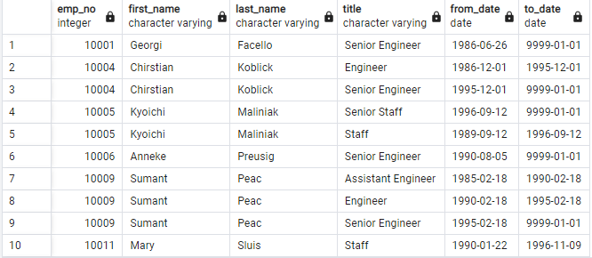
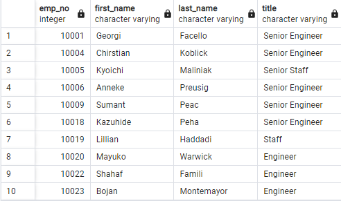
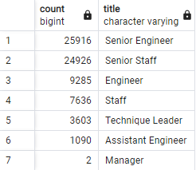
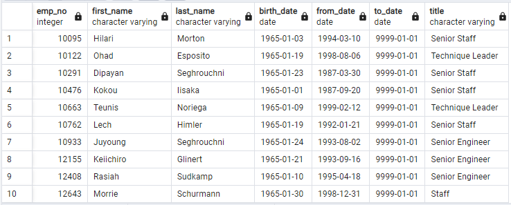

# Pewlett-Hackard-Analysis
For this project we were given a csv file containing the employees retirements data. The purpose behind this project is to write queries in order to determine the number of retiring employees per title, all the retiring employees within specific date of birth along with their respective titles, all retiring employees with unique titles, and number of retiring employees that are eligible for mentorship program. 

# Results:

> From the retirement_titles query sample, we see all the individuals who are to be retired but also, we see some of their names appear twice. This is due to case that they were promoted to a senior position. Thus it makes sense of why some names appearing twice. 

> This table is an upgraded version of the previous table, as it only shows the retiring employees's titles before their retirement. Thus, we do not see any names appearing more than once. Hence it is named, uniqe_titles table. 

> This table only shows the number of employees that are ready for retirement per title. We can also see that there are many retirees with senior position compared to normal position. It is also interesting to note that there are only two managers.

> This table is for the retirees that might be interested in mentorship program if they choose to do so. On this table, we collected the retirees within specific date of birth and they're still in the company. We made sure to include the unique titles requirement as we don't want same name appearing more than once in the case that the employee was promoted in the past. 

# Summary:
Since we determined that there are 24,916 Senior Engineers, 24,926 Senior Staff members, 9,285 Engineers, 7,636 Staff members, 3,603 Technique leaders, 1,090 Assistent Enginners, and two Managers retiring from the companee, we would have to dedicate more resources to filling the roles of titles that have the highest retirees, for example: Senior Engineers and Staff members. However, writing a query: "SELECT COUNT(ut.emp_no) FROM unique_titles as ut;" tells us that 72,458 roles that needs to be filled.

Also, writing a query to find how many retirees qualifies for mentor ship program: "SELECT COUNT(me.emp_no) FROM mentorship_eligibilty as me;" tells us that only 1549 retirees are qualified. It could be possible for these many mentors to mentor the next generation of Pewlett Hackard's employees if each mentor is responsible for teaching approximately 47 emplyees.
